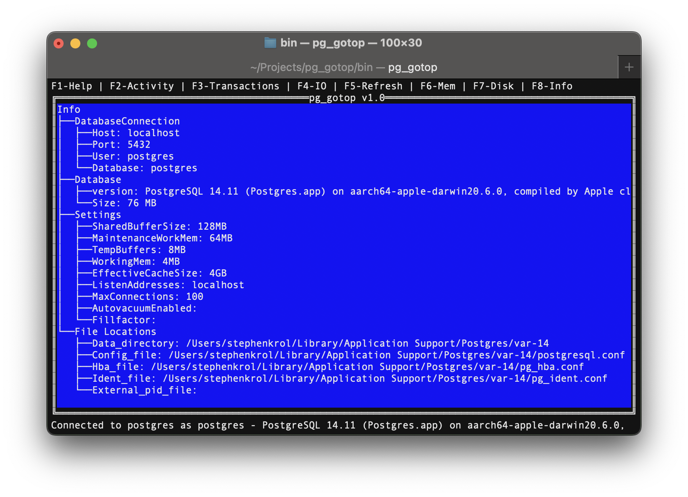

# PG Go Top

Another postgresql monitoring tool.


## Intro

pg_gotop is a `top`/`htop` alike utility used to monitor postgresql databases.
It opens a database connection and lists different resources like: 
current backend processes, long running transaction, IO and memory resources.

It uses internaly the `pg_catalog` system tables like `pg_stats_activity` and uses system administration funcions like `pg_terminate_backend` to administrate and monitor a postgresql databases.


## Usage

To show the options 
```bash
$ pg_gotop --help
$ pg_gotop -h
```

To show the current version
```bash
$ pg_gotop --version
$ pg_gotop -v
```

Running pg_gotop will prompt for a password if needed to be able to connect to the database. 

The default values: 
* **User**: postgres
* **Database Name**: postgres
* **Host**: localhost
* **Port**: 5432 

To use a specific database connection use :
```bash
$ pg_gotop -d $db -U $user -h $host -p $port
Enter Password:  
```

## Screenshots
The info panel


The running transactions panel


The activity panel

 

## Dependencies

* Go version 1.22
* **tview**: https://github.com/rivo/tview : Terminal high level lib
* **tcel**: https://github.com/gdamore/tcell : Terminal UI lib
* **pq**: https://github.com/lib/pq : Postgres driver


## Build and test

For building the project:
```bash
$ go build -o bin/
```

Execute the tool with the defaults:
```bash
$ bin/pg_gotop
```
